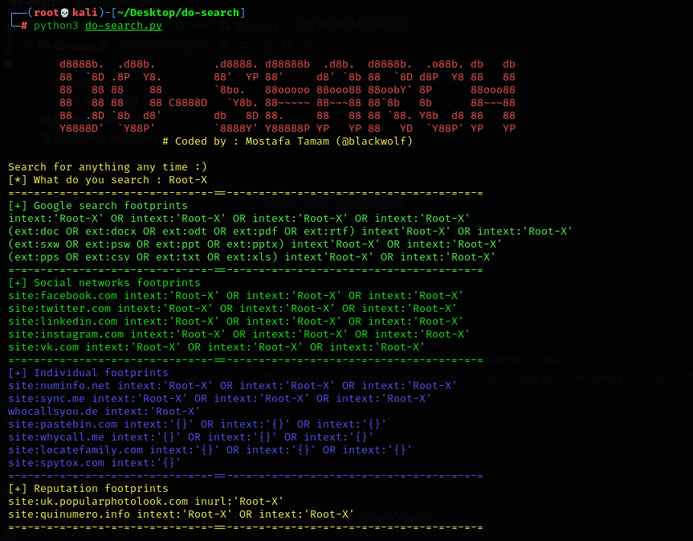

## What is do-search ?
 ### 🔭 Search anything anytime
 - This is a tool by using Google dorks for advanced searching in Google 
   and other Google applications to find security holes in the configuration
   and computer code that websites are using
 - Searching every word in **pdf,docx,doc,rtf,sxw,psw,ppt,pptx,pps,csv,txt,xls** 

## install & run
```
git clone "https://github.com/BlackWolfed/do-search.git"
```
```
cd do-search
```
```
python3 do-search.py
```



### Connect with me:

[][website]
[][twitter]
[][linkedin]

[website]: https://root-x.dev
[twitter]: https://twitter.com/BlackWo50331384
[linkedin]: https://www.linkedin.com/in/mostafa-bn-tamam-96308216a/
